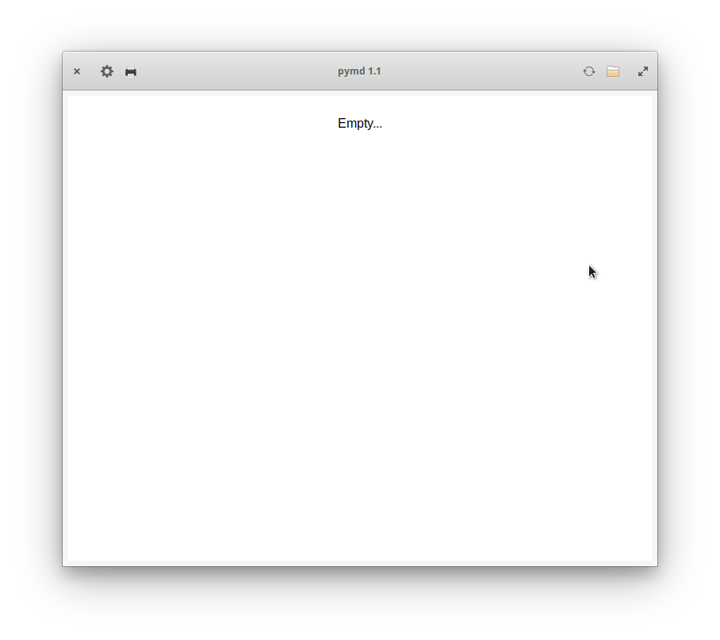
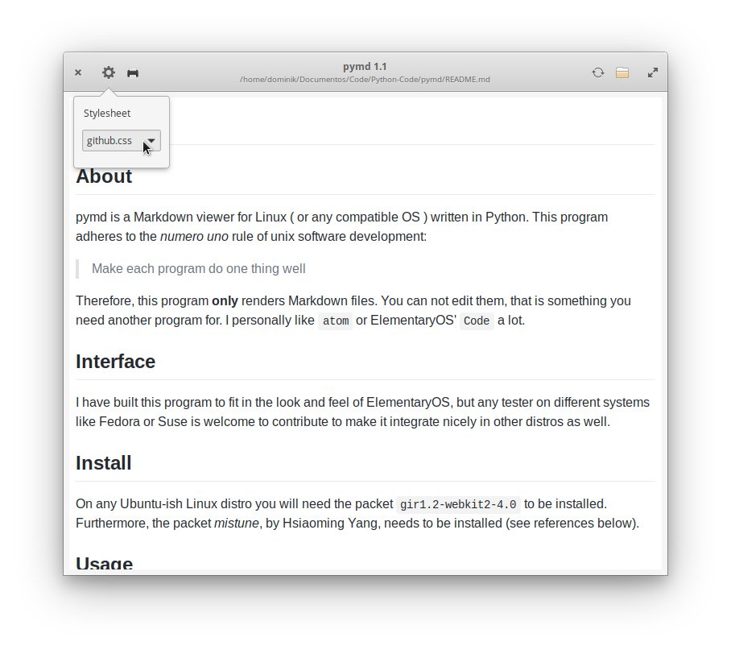

# pymd

## About

pymd is a Markdown viewer for Linux ( or any compatible OS ) written in Python. This program adheres to the *numero uno* rule of unix software development:

> Make each program do one thing well

Therefore, this program **only** renders Markdown files. You can not edit them, that is something you need another program for. I personally like `atom` or ElementaryOS' `Code` a lot.

## Interface

I have built this program to fit in the look and feel of ElementaryOS, but any tester on different systems like Fedora or Suse is welcome to contribute to make it integrate nicely in other distros as well.

## Install

On any Ubuntu-ish Linux distro you will need the packet `gir1.2-webkit2-4.0` to be installed.
Furthermore, the packet *mistune*, by Hsiaoming Yang, needs to be installed (see references below).

## Usage

The interface has four buttons to interact, three of them have also a shortcut assigned. The main interface looks like this:

You may link a mimetype to the application and after that you will be able to open MD files from your file management app of choice.

The first button in the upper left corner allows you to change the stylesheet that is applied to your file. I have included a few stylesheets that were downloaded from a variety of websites. I did not make any of them. Please check out the authors which I have listed in the next section.

The second button in the upper right corner is the print button. This button allows you to print out the document with the current stylesheet applied. Please be aware, that if you want an ideal printing experience, you may hace to adjust the stylesheet for the media "print".

The print function may also be called by pressing <CTRL>+P.

In the upper right corner, the open button can be found. Trust me, it does just that... open a file.

The shortcut for this function is <CTRL>+O.

The button right next to it, allows to reload the current file from disc again, in case you have changed it.

This button can be accessed by the shortcut <CTRL>+R

And last but no least, there is an about box ( after all we have to be a little standard, right? ) which can be accessed by pressing F1.

### Stylesheets

Most of the stylesheets come from...

· [https://github.com/markdowncss](https://github.com/markdowncss)

· [http://jasonm23.github.io/markdown-css-themes/](http://jasonm23.github.io/markdown-css-themes/)

· [https://sindresorhus.com/github-markdown-css/](https://sindresorhus.com/github-markdown-css/)

### Based on
`mistune` library by Hsiaoming Yang available on [GitHub](https://github.com/lepture/mistune)

`WebKit2GTK` library by the GNOME Project available on [Homepage](https://webkitgtk.org/)

`pyGObject` library by the GNOME Project available on [Github](https://github.com/GNOME/pygobject)
